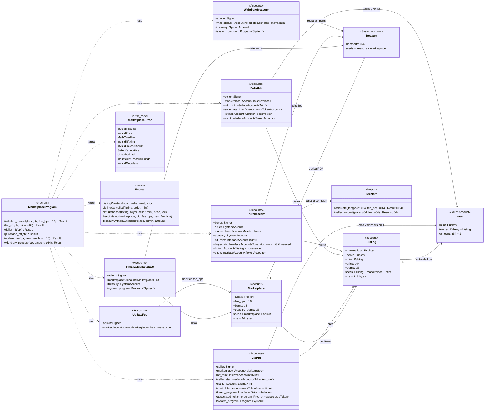
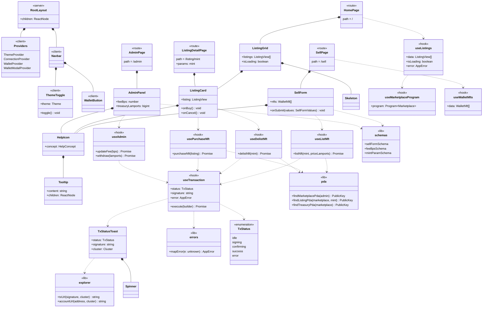

# 02 — Diagrama de Clases

Solana no tiene clases en sentido estricto: el programa Anchor se modela como **cuentas de estado** (datos), **contextos de instrucción** (`#[derive(Accounts)]`), **errores** y **eventos**. El frontend se modela como componentes, hooks y utilidades.

---

## 2.1 Programa on-chain (Anchor / Rust)



### Constraints clave por contexto

| Contexto | Constraints explícitos |
|---|---|
| `InitializeMarketplace` | `init`, `payer = admin`, `space = 44`, `seeds = [b"marketplace", admin]`, `bump`; `constraint = fee_bps <= MAX_FEE_BPS` |
| `ListNft` | `listing`: `init`, `seeds = [b"listing", marketplace, nft_mint]`; `seller_ata`: `associated_token::authority = seller`; `nft_mint`: `constraint = decimals == 0 && supply == 1` |
| `DelistNft` | `listing`: `has_one = seller`, `has_one = mint`, `close = seller`; `vault`: `associated_token::authority = listing` |
| `PurchaseNft` | `listing`: `has_one = seller`, `close = seller`; `treasury`: `seeds = [b"treasury", marketplace]`; `constraint = buyer.key() != listing.seller` |
| `UpdateFee` / `WithdrawTreasury` | `marketplace`: `has_one = admin`; `admin`: `Signer` |

---

## 2.2 Frontend (Next.js App Router)



### Tipos compartidos del frontend

```typescript
/** Vista de una publicación lista para renderizar. */
export interface ListingView {
  address: string;       // PDA del Listing
  seller: string;
  mint: string;
  priceLamports: bigint;
  name: string;
  imageUrl: string;
}

/** Error normalizado para la UI. */
export interface AppError {
  code: "WALLET_REJECTED" | "INSUFFICIENT_SOL" | "PROGRAM_ERROR" | "NETWORK" | "UNKNOWN";
  message: string;       // mensaje en español para el usuario
}

/** Conceptos con tooltip de ayuda. */
export type HelpConcept = "BPS" | "PDA_ESCROW" | "RENT" | "ROYALTIES";
```
