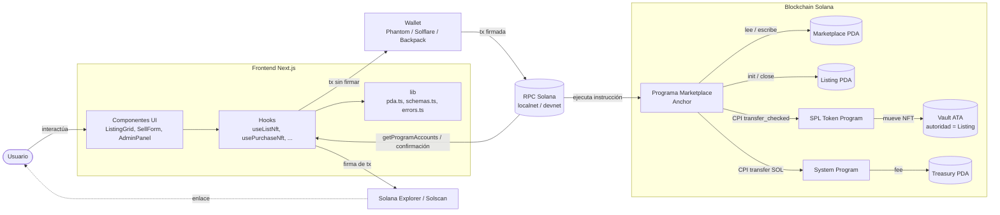
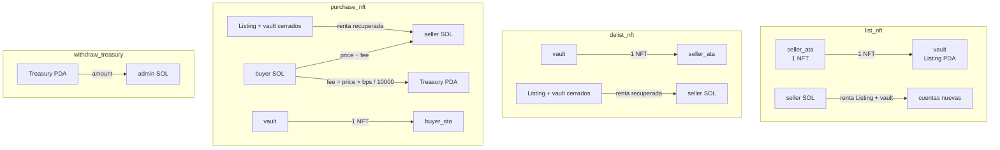
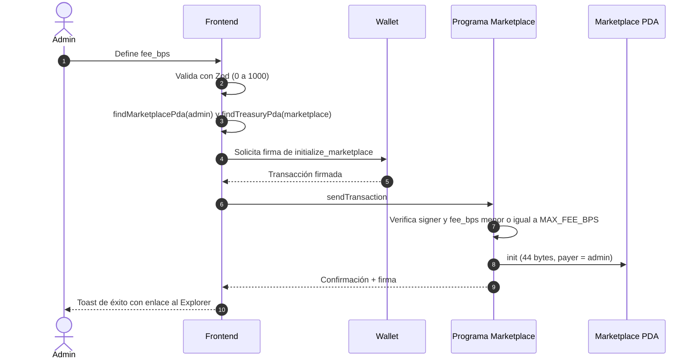
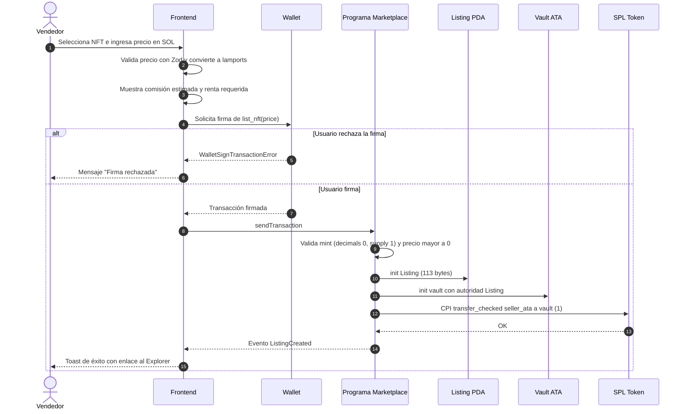
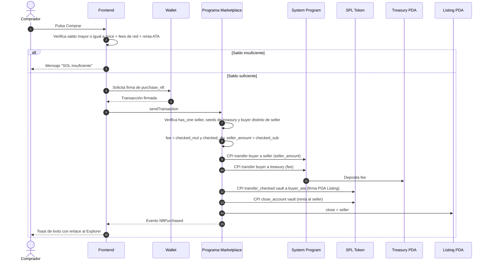
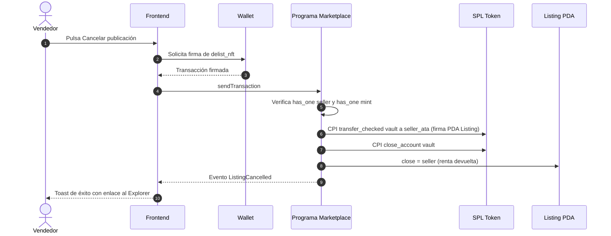
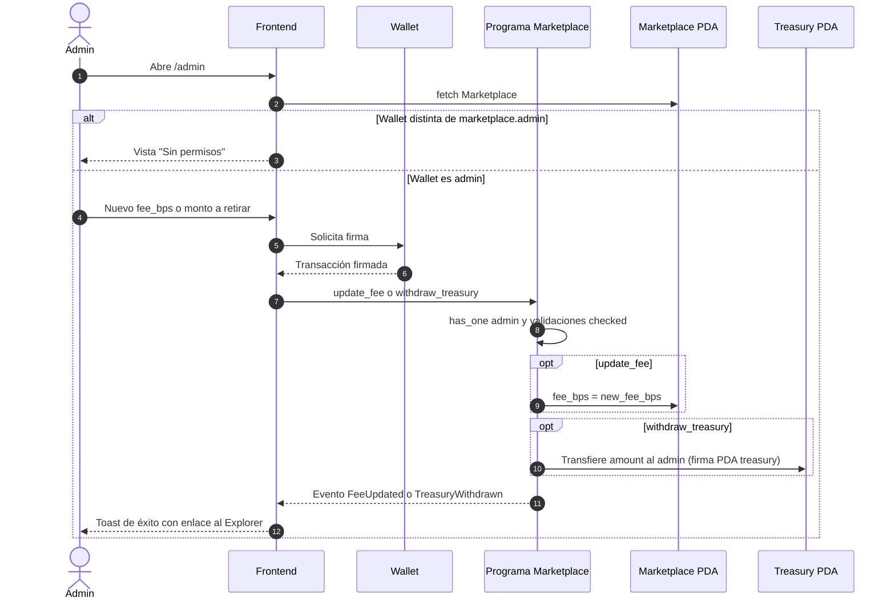

# 03 — Diagrama de Flujo (flujo de datos y de transacciones)

Este documento muestra **cómo viajan los datos y los activos** (SOL y NFT) entre los actores del sistema: usuario, frontend, wallet, RPC, programa Anchor y cuentas on-chain. La lógica de decisiones paso a paso está en [04-flujograma.md](./04-flujograma.md).

---

## 3.1 Arquitectura y flujo de datos general

---

## 3.2 Flujo de activos por instrucción

---

## 3.3 Secuencia: inicializar el marketplace

---

## 3.4 Secuencia: publicar un NFT (`list_nft`)

---

## 3.5 Secuencia: comprar un NFT (`purchase_nft`)

---

## 3.6 Secuencia: cancelar publicación (`delist_nft`)

---

## 3.7 Secuencia: administración (`update_fee` / `withdraw_treasury`)

