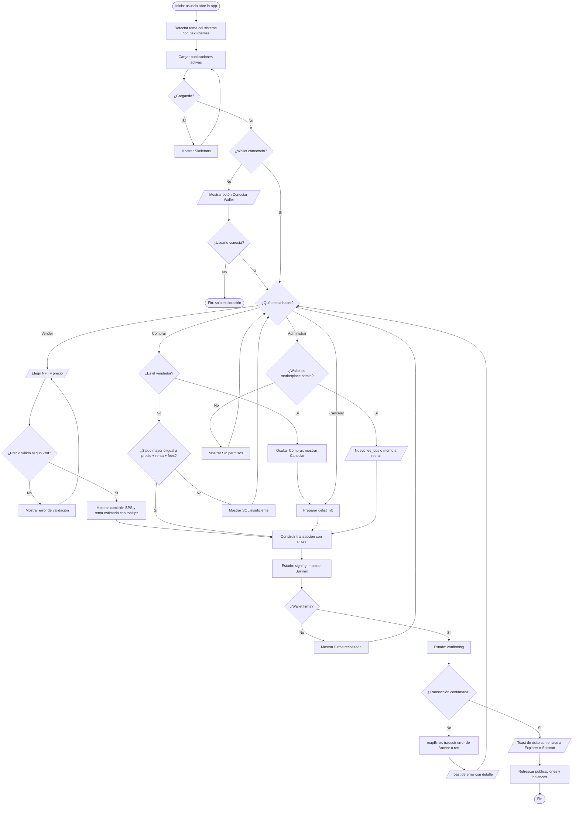
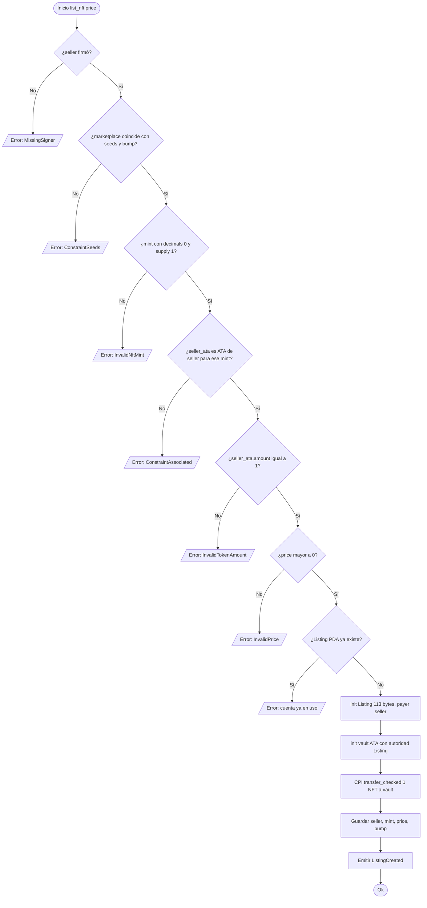
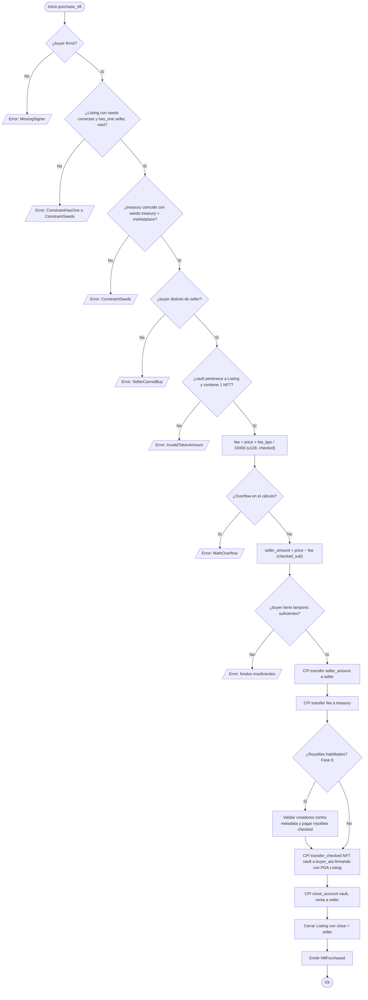
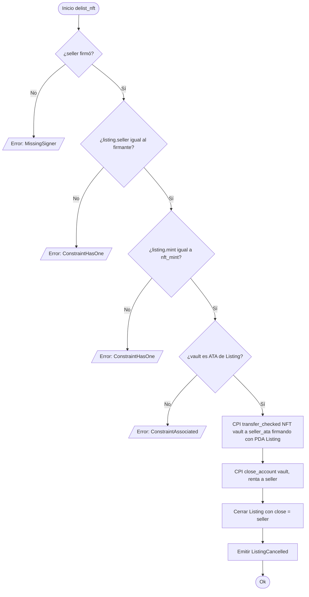
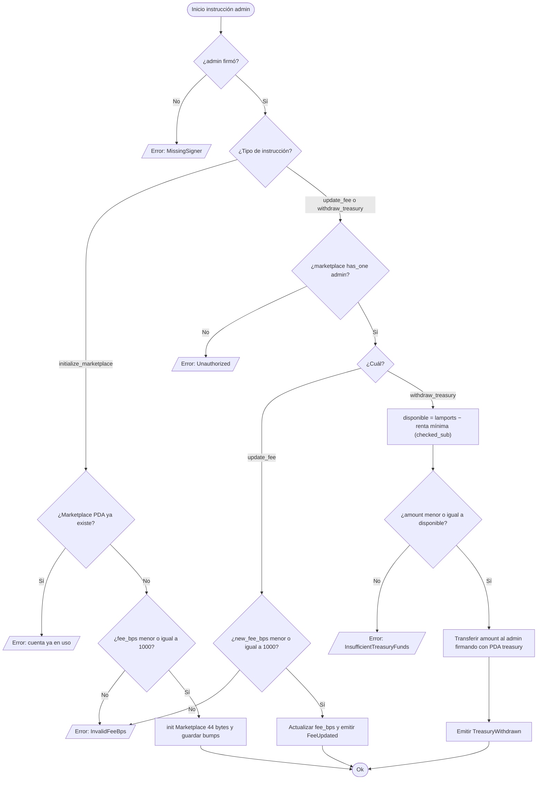

# 04 — Flujograma (lógica de decisiones)

Mientras el [diagrama de flujo](./03-diagrama-de-flujo.md) muestra cómo se mueven los datos y activos entre actores, este flujograma describe **la lógica paso a paso con sus decisiones**: el recorrido del usuario en la interfaz y las validaciones que ejecuta cada instrucción on-chain.

**Simbología:** `([ ])` inicio/fin · `[ ]` proceso · `{ }` decisión · `[/ /]` entrada/salida.

---

## 4.1 Recorrido del usuario en el frontend

---

## 4.2 Validaciones on-chain de `list_nft`

---

## 4.3 Validaciones on-chain de `purchase_nft`

---

## 4.4 Validaciones on-chain de `delist_nft`

---

## 4.5 Validaciones on-chain de administración

> **Nota:** en `initialize_marketplace` no se aplica `has_one admin` porque la cuenta aún no existe; la PDA se deriva con `seeds = [b"marketplace", admin]`, lo que ata la configuración al firmante.
